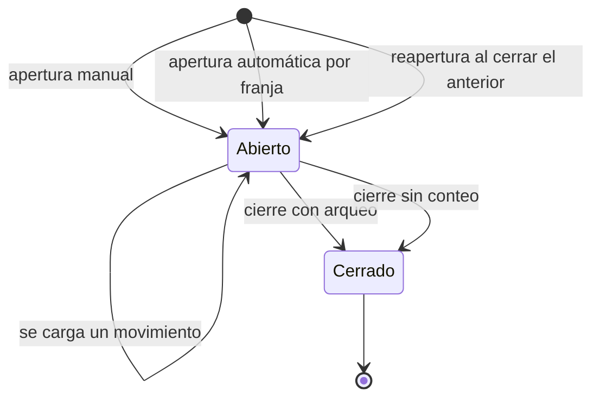
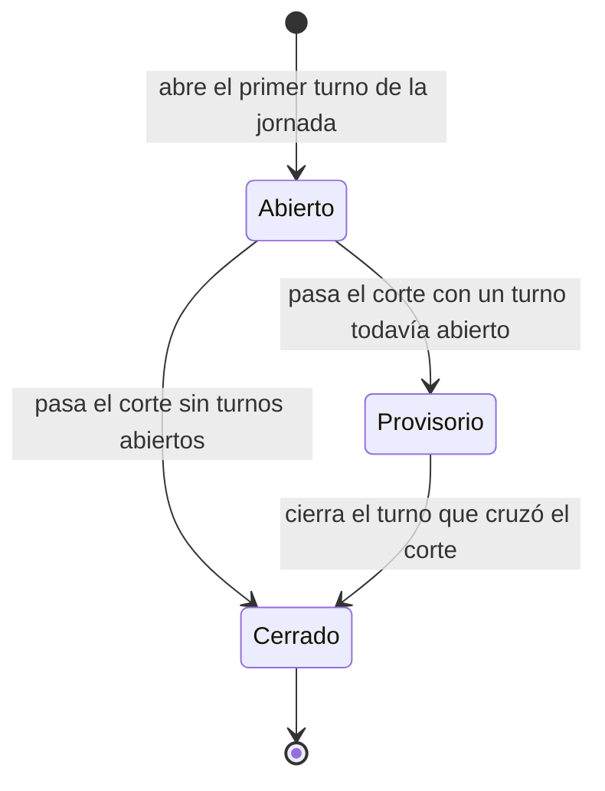

# Caja — día operativo (propuesta)

> [!note] El modelo corregido, no el implementado
> El servicio tal como está hoy —opt-in, horarios, modelo de datos, endpoints, deuda
> técnica— vive en [[Caja]]. Esta nota describe el modelo con la entidad **Día**, que no
> existe todavía: `[hoy]` marca lo que ya está construido y `[nuevo]` lo que se propone.

Qué es cada cosa en el módulo de caja, cómo se llama y qué reglas no se pueden violar.
Es normativo: el código, la UI y el resto de los documentos usan estos nombres y ningún
otro.

Este documento describe el modelo **corregido**, que no es del todo el que está
construido. Para que no se confundan, cada afirmación va marcada:

- **[hoy]** — está en el código y se puede señalar con archivo y línea.
- **[nuevo]** — lo propone este documento y todavía no existe.
- **[supuesto]** — no se pudo verificar.

Lo que hay hoy es un módulo con una sola entidad: el ciclo apertura→cierre, que la base
llama `CashRegisterSession` y la pantalla llama "Caja del día". Ese rótulo miente. En un
mismo día calendario hay varios de esos ciclos —el 3 de agosto hubo cuatro, abriendo 03:54,
09:50, 09:53 y 19:36— y no existe ninguna entidad que agrupe la jornada. Peor: cerrar un
turno abre el siguiente en la misma transacción **[hoy]**, así que la caja nunca termina un
día, solo encadena turnos.

De acá para abajo se arregla eso. La interfaz es otro documento y vive del otro lado del
vault: `ux-caja` en `frontend/`, todavía sin escribir.

---

## Entidades

### Día **[nuevo]**

**Qué representa.** La jornada operativa del local: todo lo que pasó "el martes", con la
definición de martes que usa el local y no la que usa el calendario. Es la unidad en la que
piensa quien administra ("¿cómo nos fue ayer?") y hoy no tiene dónde apoyarse.

**Qué lo crea.** La apertura del primer turno de la jornada. No hay día vacío: un día sin
turnos no existe como registro.

**Qué lo destruye.** Nada. Se cierra solo cuando pasa la hora de corte, y no se borra.

**Con qué se relaciona.** Uno a muchos con el turno: un día tiene cero o más turnos, y cada
turno pertenece a exactamente un día.

**Campos.** La fecha operativa (la jornada que nombra), el tenant, el estado, y sus
agregados: los flujos sumados, el saldo de cierre, la diferencia acumulada, cuántos turnos
no cuadraron y cuántos se cerraron sin contar.

#### Cómo se representa

La recomendación es **no crear una tabla**, sino una columna `operativeDate` en el turno,
congelada al abrir, más una proyección de lectura que agrupa por esa columna.

El motivo es que el módulo ya usa exactamente ese criterio y funciona: `label` y
`expiresAt` se materializan al abrir el turno **[hoy]** justamente para que editar el
horario mañana no mueva un turno que ya está corriendo. La pertenencia a un día es el mismo
tipo de dato —una decisión que se toma una vez, en el momento de abrir, y después es
histórica— así que merece el mismo tratamiento. Una tabla aparte agrega un segundo lugar
que se puede desincronizar y obliga a mantenerlo vivo con escrituras que nadie pidió.

La alternativa sí compra algo y por eso queda como decisión abierta: una tabla real da un
lugar donde colgar la nota del día y un estado escrito en vez de derivado.

Ilustrativo, no es código a escribir:

```ts
interface CashDay {
  /** Fecha operativa, "2026-08-03". La define la hora de corte, no la medianoche. */
  date: string;
  status: "ABIERTO" | "PROVISORIO" | "CERRADO";
  /** Los turnos de la jornada, la fila que ya devuelve GET /cash-register. */
  shifts: CashSessionListItem[];
  /** Lo sumable. */
  flows: { sold: number; cashIn: number; cashOut: number; withdrawn: number };
  /** Lo NO sumable: sale del último turno cerrado, no de una suma. */
  balance: { pettyCash: number; transfer: number };
  accumulatedDifference: number;
  /** El acompañante obligatorio del número de arriba. */
  unbalancedShifts: number;
  countedShifts: number;
  uncountedShifts: number;
}
```

#### Qué se suma y qué no

Esta es la regla central del día y la razón por la que el día **no es un turno grande**.
Los números de caja se dividen en tres categorías y solo una se puede sumar.

- **Flujos — se suman.** Vendido, cobrado por medio, ingresos, egresos, retirado (caja
  grande) y las diferencias.
- **Saldos — no se suman: se toma el último.** La caja chica al cierre y el saldo de
  transferencias.
- **Conteos — no existen a nivel día.** Contado y esperado son del turno y solo del turno.

Con los tres turnos cerrados del 3 de agosto se ve de una **[supuesto: datos aportados, no
verificados contra la base]**:

|  | Turno 03:54 | Turno 09:50 | Turno 09:53 | Suma |
|---|---:|---:|---:|---:|
| Contado | $11.999,99 | $12.999,94 | $20.000,00 | $44.999,93 |
| Diferencia | +$722,39 | −$5.277,65 | +$1.302,06 | −$3.253,20 |

Los $44.999,93 no existieron nunca. Son los mismos billetes contados tres veces: al final
del día en el cajón había $20.000. Con transferencias es peor, porque cada turno arrastra
el saldo del anterior: sumadas dan $58.684,80 y el saldo real es $28.960,40. Los
−$3.253,20, en cambio, son plata que efectivamente no se puede explicar, y son la única
cifra de ese cuadro que significa algo.

El par que lo deja claro es **caja grande contra caja chica**. Tienen la misma forma —un
monto de efectivo declarado al cerrar— y se comportan al revés: cada retiro es plata
distinta que sale físicamente del local, así que se suma; la caja chica de tres turnos son
los mismos billetes quietos en el cajón, así que sumarlos los triplica.

De ahí sale la consecuencia que hereda la interfaz: **la diferencia acumulada es lo único a
la vez significativo y sumable**, y por eso es la señal de control del día. Pero el neto
miente por compensación —un día de +$5.000 y −$5.000 no es un día sano, es uno con dos
problemas— así que nunca va solo: al lado va **cuántos turnos no cuadraron**, 3 de 3 en el
ejemplo, que es la alarma que el neto no da.

El denominador de ese contador son los turnos **con arqueo firmado**. Un turno cerrado sin
conteo no aporta diferencia porque no la tiene, y no puede contarse como "cuadró": es una
tercera categoría y se muestra aparte. Por eso el cuarto turno de ese día, el de las 19:36,
no aparece en el cuadro.

### Turno **[hoy]**

**Qué representa.** Un ciclo de apertura a cierre sobre el cajón físico: alguien abre, se
mueve plata, alguien cuenta y firma. Es lo que hoy se llama, mal, "caja del día".

**Qué lo crea.** Tres caminos, todos en `services/cash-register.js`:

1. **Apertura manual** (`open`): una persona declara con cuánto arranca.
2. **Apertura automática** (`ensureScheduledSession`): el local tiene franjas horarias
   cargadas, entra un cobro o alguien abre el panel dentro de una franja y no hay turno
   abierto. No hay job ni scheduler: se resuelve en el momento.
3. **La reapertura del cierre anterior**: cerrar con arqueo abre el turno siguiente en la
   misma transacción, salvo que se pida explícitamente lo contrario.

**Qué lo destruye.** Nada lo borra. Termina de dos maneras: cierre con arqueo, firmado por
una persona, o **cierre sin conteo**, que ejecuta el sistema cuando el turno venció, pasó
una hora de gracia y ya arrancó otra franja. Un turno cerrado es histórico y no se reabre.

**Con qué se relaciona.** Pertenece a un día **[nuevo]**. Tiene N movimientos. Tiene las
órdenes que archivó al cerrar, vinculadas por `Order.cashSessionId` y no por los
movimientos —una orden cancelada, una de MercadoPago o una entregada sin cobrar no generan
movimiento y se caerían del historial justo cuando son las que hay que mirar—.

**Campos**, agrupados por el momento en que se escriben:

| Momento | Campos |
|---|---|
| Apertura | `openingAmount`, `openingTransferAmount`, `openedById`, `openedAt`, `openingNote`, `trigger` |
| Franja materializada | `label`, `expiresAt` |
| Día **[nuevo]** | `operativeDate` |
| Cierre | `closedById`, `closedAt`, `closingNote`, `closedWithoutCount` |
| Arqueo | `expectedCashAmount`, `countedCashAmount`, `cashDifference`, `transferTotal`, `expectedTransferAmount`, `countedTransferAmount`, `transferDifference` |
| Reparto | `withdrawnCashAmount`, `pettyCashAmount` |

Los dos saldos de apertura pueden ser negativos **[hoy]**, y no porque alguien los declare
así —Zod lo rechaza— sino porque arrastran el cierre anterior: un turno que terminó con el
esperado en negativo significa que falta registrar un ingreso, y redondearlo a cero borraría
justo el desvío que la caja existe para mostrar.

### Movimiento **[hoy]**

**Qué representa.** Una entrada o una salida de plata dentro de un turno.

**Qué lo crea.** Dos orígenes que no se mezclan. Los manuales los carga una persona
(`POST /cash-register/movements`) y son los del local: sueldos, insumos, retiros, aportes de
cambio. Los de orden los escribe únicamente el enganche con el libro de cobros
(`recordOrderPayments`), una fila de movimiento por cada fila de cobro que no sea
MercadoPago, dentro de la misma transacción que sella el cobro.

**Qué lo destruye.** Nada, nunca. No hay endpoint para editarlo ni para borrarlo, y la
tabla no tiene `updatedAt` **[hoy]**. Un error se corrige con un movimiento nuevo, no
tocando el viejo.

**Con qué se relaciona.** Con su turno —siempre el que estaba abierto al crearse, no hay
forma de mandarlo a otro—, con una etiqueta, y opcionalmente con una orden y con la fila
del libro de cobros que lo originó.

**Campos.** `type`, `channel`, `amount`, `categoryId`, `payee`, `orderId`,
`orderPaymentId`, `note`, `createdById`, `createdAt`.

Dos cosas del modelo que hay que decir juntas. El **monto es siempre positivo** y el signo
lo aporta el tipo, en un solo lugar del código; guardar montos con signo invita a que
alguien escriba −50 en un ingreso y nadie se entere hasta que el arqueo no cierra. Y los
tipos son **cinco**, no cuatro:

| Tipo | Qué es | Signo | Quién lo escribe |
|---|---|---|---|
| `ORDER_DEPOSIT` | Seña cobrada de una orden | + | El sistema |
| `ORDER_PAYMENT` | Cobro de una orden | + | El sistema |
| `ORDER_REFUND` | Devolución al cliente | − | El sistema |
| `INCOME` | Ingreso manual | + | Una persona |
| `EXPENSE` | Egreso manual | − | Una persona |

El **medio** es efectivo o transferencia. MercadoPago no es un medio de la caja: esa plata
no pasa por el cajón y la base impide que entre.

### Etiqueta **[hoy]**

**Qué representa.** La clasificación con la que el local responde "cuánto gasté en insumos
este mes". Es la taxonomía del tenant, no una regla nuestra.

**Qué la crea.** El catálogo de arranque se siembra al habilitar la caja (sueldos, insumos,
proveedores, servicios, retiro de caja, aporte de cambio, apertura, ajuste), y después el
tenant agrega las suyas.

**Qué la destruye.** Solo se borra una etiqueta que nunca se usó. Con movimientos se
desactiva: un movimiento de hace tres meses tiene que seguir diciendo qué era.

**Con qué se relaciona.** Con el tenant, que es su dueño, y con los movimientos que la
usan. Es la única entidad del módulo que no cuelga de un turno: vive en el catálogo y
sobrevive a todos.

**Campos.** `key` (slug estable, no editable), `label` (el nombre visible, sí editable),
`applies`, `position`, `isActive`, `isSystem`.

Dos reglas que la UI tiene que respetar. `applies` declara a qué dirección sirve la
etiqueta —"Sueldos" no es un ingreso jamás— y se valida al crear el movimiento. Y las
**etiquetas reservadas** (`venta`, `devolucion`) las usa el enganche con los cobros: se
pueden renombrar, porque cada rubro les dice distinto, pero no se desactivan, no se les
cambia la dirección y no se ofrecen para un movimiento manual. Existen para que el resumen
por etiqueta cubra el 100% de la plata.

### Arqueo **[hoy]**

**Qué representa.** El resultado de contar: qué debería haber, qué había, y la diferencia.
Por cada medio, porque se cuentan contra cosas distintas —billetes contra el cajón, resumen
del banco contra la cuenta— y un solo número mezclado no significaría nada.

**No es una tabla.** Son columnas del turno, y este documento no propone separarlas.

**Qué lo crea.** El cierre. Antes de eso no hay arqueo firmado; lo que hay es el mismo
cálculo en vivo, recalculado en cada request mientras el turno está abierto.

**Qué lo destruye.** Nada: es el hecho firmado del turno y por definición no se recalcula.
Un error se corrige con un movimiento en el turno siguiente, no editando el arqueo de ayer.

**Con qué se relaciona.** Uno a uno con su turno. Se apoya en los movimientos para el
esperado, pero una vez firmado ya no depende de ellos.

Las dos caras conviene nombrarlas porque se comportan distinto:

- **Arqueo vivo:** se recalcula siempre. Es lo que muestra el panel durante el turno.
- **Arqueo firmado:** es un snapshot que no se recalcula nunca. Si mañana se corrige algo,
  el arqueo de ayer sigue diciendo lo que dijo cuando se firmó.

**Campos, por medio.** Esperado, contado, diferencia. Más una advertencia derivada:
`expectedNegative`, que se prende cuando el esperado del cajón da negativo. Un cajón no
puede deber plata, así que eso significa que falta registrar un ingreso. Avisa y no bloquea
nada.

**Un turno cerrado sin conteo no tiene arqueo.** Contado y diferencia quedan vacíos a
propósito, y eso **no es lo mismo que un arqueo en cero**: "nunca se contó" y "se contó y
cuadró" son dos hechos distintos y no se pueden mostrar igual.

### Reparto **[hoy]**

**Qué representa.** Cómo se divide el efectivo contado al cerrar. La plata se lleva todos
los días y queda un fondo para arrancar el siguiente.

**No es una tabla.** Dos columnas del turno.

**Qué lo crea.** El cierre con arqueo. Se declara un solo número —lo que se retira— y el
otro se calcula.

**Qué lo destruye.** Nada, por el mismo motivo que el arqueo. Un turno cerrado sin conteo
no tiene reparto: si nadie contó, no hay cómo repartir.

**Con qué se relaciona.** Uno a uno con su turno, y con el turno siguiente por el lado de
la caja chica, que es su monto de apertura. Es el único dato de un turno cerrado que sigue
teniendo efecto sobre otro.

**Campos.** `withdrawnCashAmount` es la **caja grande**: lo que sale del local.
`pettyCashAmount` es la **caja chica**: lo que queda en el cajón, y es con lo que abre el
turno siguiente. La chica es derivada (contado − retirado) pero se guarda igual, porque es
parte del arqueo firmado y recalcularla mañana sería recalcular un snapshot.

No se puede retirar más de lo contado **[hoy]**: eso dejaría el cajón en negativo por una
cuenta mal hecha, que es distinto del único negativo que la caja acepta —el del movimiento
que falta registrar—.

---

## Vocabulario

Normativo. La columna de la derecha es lo que cada término reemplaza.

| Término | Definición | Reemplaza a |
|---|---|---|
| **Día** | La jornada operativa, definida por la hora de corte. Agrupa turnos. | — (no existía) |
| **Turno** | Un ciclo apertura→cierre sobre el cajón. | "caja", "caja del día", "sesión" |
| **Franja** | El tramo horario que el local configura en su horario. Es una plantilla, no una instancia. | "turno" cuando se hablaba del horario |
| **Movimiento** | Una entrada o salida de plata dentro de un turno. | — |
| **Medio** | Por dónde se movió la plata: efectivo o transferencia. | "canal", "vía" |
| **Etiqueta** | La clasificación del movimiento para analizar gastos. | "categoría" |
| **Arqueo** | Comparar esperado contra contado, en un instante, sobre un cajón. | "cierre de caja" cuando se refiere a los números |
| **Reparto** | Cómo se divide lo contado al cerrar. | — |
| **Caja grande** | El monto retirado del cajón al cerrar. Sale del local. | "retiro" |
| **Caja chica** | El efectivo que queda en el cajón y con el que abre el turno siguiente. | "fondo", "vuelto" |
| **Esperado** | Lo que el sistema calcula que debería haber. | — |
| **Contado** | Lo que una persona declaró después de contar. | — |
| **Sobrante** | Diferencia a favor: hay más de lo esperado. | "diferencia positiva" |
| **Faltante** | Diferencia en contra: hay menos de lo esperado. | "diferencia negativa" |
| **Diferencia acumulada** | La suma de las diferencias de los turnos de un día. **No es un arqueo del día.** | — |
| **Arrastre** | El saldo con el que un turno arranca, heredado del cierre anterior. | — |
| **Hora de corte** | La hora que separa un día operativo del siguiente. | "medianoche" |
| **Turno vencido** | Un turno abierto pasada su hora de fin. Es derivado, no un estado. | — |
| **Cierre sin conteo** | Un turno que cerró el sistema porque venció y nadie contó. No tiene arqueo. | "cierre automático" |

### El día no tiene arqueo

Vale la pena decirlo como definición y no como aclaración: **un arqueo es comparar esperado
contra contado, en un instante, sobre un cajón**. El día no es un instante y no tiene cajón
propio: es el mismo cajón físico durante todos sus turnos. No hay nada que contar a nivel
día. Lo que el día tiene es diferencia acumulada, que es otra cosa y se llama distinto.

### El par que falta resolver

Hoy la palabra "turno" nombra dos cosas distintas en el mismo módulo. `CashShift`, en
`packages/shared/types/tenant-config.ts:10`, es la **plantilla horaria** que configura el
tenant, y su comentario dice textual "Un turno de caja del tenant"; en el backend,
`shiftFor`, `shiftStart` y `shiftExpiry` operan sobre esa misma plantilla. Mientras tanto,
la instancia que tiene plata adentro se llama `CashRegisterSession`.

La propuesta de este documento es **franja** para la plantilla y **turno** para la
instancia. Es una decisión de vocabulario que se toma acá aunque no se aplique todavía,
porque es el bloqueante del renombre en base y no se destraba con el paso del tiempo.

### Alcance

Mientras el renombre en base esté diferido (ver
[[CAJA_DECISIONES]]), este vocabulario
manda en los strings de la interfaz, en los identificadores nuevos y en la documentación.
**No toca** modelos, tablas, columnas, enums ni el contrato tipado existente.

---

## La hora de corte

> Un día operativo no va de 00:00 a 23:59. Se define por una hora de corte configurable por
> local (default sugerido: 05:00). Un turno pertenece al día operativo en el que se abrió.

Sin esto, todo turno nocturno que cruza la medianoche queda archivado en el día equivocado:
el turno real de las 03:54 del 3 de agosto pertenece a la jornada del 2, y con la medianoche
como frontera aparece encabezando el 3 como si fuera la primera caja de la mañana.

No es una idea nueva para este código, es la que faltaba terminar. El horario de franjas ya
trata la medianoche como un obstáculo a esquivar: una franja con el fin menor que el inicio
"cruza la medianoche" y ocupa dos tramos, y hay funciones dedicadas a resolver cuándo
empezó y cuándo termina la ocurrencia vigente **[hoy]**. Lo que falta es que esa misma idea
llegue a la jornada.

**Dónde vive el campo.** Junto a `cashSchedule`, en la configuración del tenant, y lo edita
el tenant igual que sus franjas **[nuevo]**: no existe hoy.

### Un turno que cruza el corte estando abierto

Pertenece al día en que abrió, y esa pertenencia se congela al abrir. Un turno que abre
23:40 y cierra 06:10 es del día anterior, entero, con todos sus movimientos —incluidos los
de las 05:30—. Es el mismo criterio con el que ya se materializan `label` y `expiresAt`, y
la razón es la misma: un turno no puede cambiar de jornada a mitad de camino.

De ahí sale un estado incómodo que conviene decir en voz alta. Como el día se cierra solo
al pasar el corte, si en ese momento queda un turno abierto de esa jornada, **el día queda
cerrado con totales provisorios** hasta que ese turno cierre. Es el único caso en que un día
cerrado sigue moviéndose, y la vista tiene que marcarlo en vez de mostrar un total que
todavía va a cambiar.

### El día termina solo, no lo cierra nadie

No hay acción de "cerrar el día". Lo cierra el paso del corte, y se deriva cuando alguien
pregunta —igual que "vencido", que no es un estado escrito sino una comparación de fechas—.
Esto es deliberado: en este módulo no hay scheduler, y un job perdido en el módulo del
dinero es peor que no tener job, porque no hay nada que se pueda "no ejecutar".

Hay una consecuencia que sorprende y hay que documentar: **la reapertura mueve el día
sola**. Cerrar un turno abre el siguiente con la hora del cierre, así que si el cierre cae
después del corte, el turno nuevo ya nace en la jornada siguiente sin que nadie lo decida.
Un día termina por el paso del tiempo, no por una acción.

### Migración de la data existente

El backfill es determinista y reejecutable: la fecha operativa de cada turno sale de su hora
de apertura, restándole el corte del local. Los tenants que no tengan corte configurado
toman el default.

```sql
-- Ilustrativo. El corte real sale de la configuración del tenant.
UPDATE "CashRegisterSession"
SET "operativeDate" = ("openedAt" - interval '5 hours')::date;
```

Cambiar la hora de corte más adelante **no reprocesa la historia**: los turnos ya archivados
conservan su día. Es el mismo criterio que el arqueo firmado —un número que se calculó una
vez, en su momento, no se recalcula con las reglas de hoy— y evita que tocar una
configuración reescriba jornadas que alguien ya miró y cerró.

---

## Invariantes

Reglas que el sistema no puede violar. Cada una dice si hoy se cumple.

**Del día**

- Un día tiene cero o más turnos; un turno pertenece a exactamente un día. **Nueva** — la
  noción no existe.
- Un día cerrado no admite turnos nuevos. **Nueva.**
- El día no tiene conteo ni arqueo propio: solo flujos sumados, el último saldo y la
  diferencia acumulada. **Nueva.**
- La diferencia acumulada solo suma turnos con arqueo firmado; los cerrados sin conteo se
  cuentan aparte. **Nueva.**

**Del turno**

- Como máximo un turno abierto por vez. **Se cumple** — hay un índice único parcial sobre
  los turnos abiertos, que es la garantía estructural del módulo: sin él, dos requests
  simultáneos crean dos turnos y el arqueo pierde sentido.
- La caja chica de un turno cerrado es el efectivo de apertura del siguiente. **Se cumple**
  — tanto en la reapertura automática como en el arrastre de una apertura manual.
- Un turno cerrado es inmutable: no se reabre y no se editan sus movimientos. **Se cumple
  de hecho** — no existe endpoint que lo permita, que no es lo mismo que estar prohibido.
- Un turno que se cierra sin conteo no tiene arqueo, y no puede presentarse como que cuadró.
  **Se cumple** en el modelo.
- La apertura que sigue a un cierre sin conteo exige contar: el monto deja de tomar el
  arrastre y pasa a ser obligatorio. **Nueva.**

**Del arqueo y el reparto**

- `caja grande + caja chica = efectivo contado`. Siempre. **Se cumple** al escribir, porque
  la chica es derivada, más un guard que rechaza retirar más de lo contado. No hay
  restricción cruzada en la base, y está documentado por qué.
- `diferencia = contado − esperado`, por medio, calculada solo si hubo conteo. **Se
  cumple.**
- El conteo de transferencias es opcional: vacío significa "no se chequeó el banco", no
  cero. **Se cumple**, y la restricción de completitud del cierre lo contempla
  explícitamente.
- Cerrar con diferencia distinta de cero pide una nota, pero **no bloquea**. **Nueva.** La
  advertencia aparece en sincronía con la carga del conteo —en el momento en que la
  diferencia deja de ser cero— y no al enviar el formulario.

**Del movimiento**

- Un movimiento cae siempre en el turno abierto al momento de crearse; no se puede
  backdatear a un turno ya arqueado. **Se cumple** — no hay parámetro de turno en ninguna
  escritura.
- El monto es siempre positivo y el signo lo aporta el tipo. **Se cumple** — restricción en
  la base.
- MercadoPago nunca entra a la caja. **Se cumple** — restricción en la base, además del
  filtro en el código.
- Cobrar por el cajón exige un turno abierto. **Se cumple** — falla con 409 dentro de la
  transacción del cobro, así que la orden queda sin el cobro sellado.

**De las etiquetas**

- Una etiqueta con movimientos no se borra: se desactiva. **Se cumple** — por clave foránea
  y por chequeo explícito.
- Las etiquetas reservadas no se eligen a mano ni cambian de dirección. **Se cumple.**

### El borde de la apertura que exige contar

La regla nueva de que un cierre sin conteo obliga a contar al abrir choca con un caso real:
la apertura automática no tiene una persona detrás, así que no puede exigirle un conteo a
nadie. La resolución que propone este documento es que en ese caso el turno **nace marcado
como sin verificar** y el reclamo del conteo se le hace a la primera persona que toca la
caja, en vez de bloquear una apertura que existe justamente para no frenar la venta.

---

## Máquina de estados

### Turno



*Vencido* no aparece porque no es un estado: es la comparación entre la hora de fin y ahora,
sobre un turno abierto, derivada en cada request. Escribirlo como estado obligaría a un job
que lo mantenga, y ese job es exactamente lo que este módulo evita.

| Transición | Quién la dispara | Efectos |
|---|---|---|
| Apertura manual | Una persona | Se declaran los dos saldos; el que falte toma el arrastre. Se materializan la franja y la hora de vencimiento. Queda fijada la fecha operativa **[nuevo]** |
| Apertura automática | El sistema, al entrar un cobro o al abrir el panel dentro de una franja | Igual, con el arrastre completo y sin persona registrada |
| Reapertura | El cierre del turno anterior, en la misma transacción | Abre con la **caja chica**, no con lo contado |
| Se carga un movimiento | Una persona, o el enganche con el libro de cobros | Mueve el arqueo vivo. No cambia el estado |
| Cierre con arqueo | Una persona | Sella el snapshot de los dos medios, calcula el reparto, **archiva las órdenes terminales** y abre el turno siguiente salvo que se pida dejar la caja cerrada |
| Cierre sin conteo | El sistema, cuando el turno venció, pasó la gracia y ya arrancó otra franja | Guarda el esperado, deja el conteo vacío, marca el turno y archiva igual las órdenes terminales |

Archivar una orden la saca del tablero, no de la base, y solo alcanza a las terminales: una
orden abierta no se archiva nunca, porque esconderla es exactamente cómo se pierde un
pedido.

### Día



| Transición | Quién la dispara | Efectos |
|---|---|---|
| Apertura | El primer turno de la jornada | El día empieza a existir. No hay registro previo |
| Paso del corte | El reloj, derivado al leer | El día deja de recibir turnos nuevos; los siguientes ya son de la jornada próxima |
| Cierre del turno que cruzó | La persona que cierra ese turno | Los totales del día dejan de ser provisorios |

Ninguna de las tres la dispara una acción de usuario sobre el día. No hay botón de cerrar el
día, y no debería haberlo: la acción de "dejar la caja cerrada" —que sí existe **[hoy]**, al
firmar un cierre— es otra cosa, es no abrir el turno siguiente, y no termina ninguna
jornada.

---

## Decisiones abiertas

### 1. ¿Se puede tener más de un turno abierto a la vez?

**Opciones.** Uno solo por local (lo que hay hoy, garantizado por índice único parcial), o
varios en paralelo para locales con más de una caja física.

**Recomendación: mantener uno.** Varios turnos simultáneos obligan a que cada movimiento y
cada cobro declaren a qué caja van, y hoy ninguna escritura lo hace: el movimiento cae en el
turno abierto porque hay exactamente uno. Habilitar varios no es relajar un índice, es
agregar un parámetro obligatorio a todo el módulo y una forma nueva de equivocarse al
cobrar. Vale la pena solo si aparece un local con dos cajones y dos personas cobrando al
mismo tiempo.

### 2. ¿La caja chica del último turno del día pasa al primero del día siguiente?

**Opciones.** El arrastre es entre turnos consecutivos sin mirar el día, o el día corta el
arrastre y el primer turno de la jornada declara de nuevo.

**Recomendación: entre turnos consecutivos, el día no toca la plata.** El día es una unidad
de lectura; la plata es física y no sabe qué hora es. Los billetes que quedaron en el cajón
a las 23:00 son los mismos a las 06:00, y hacer que el primer turno de la jornada los
declare de nuevo es pedir un conteo que nadie pidió y abrir la puerta a una diferencia
inventada. Además es lo que ya hace el código, así que la alternativa cuesta una migración
conceptual sin comprar nada.

### 3. ¿Qué pasa si un turno se cierra sin repartir?

**Opciones.** Todo queda como caja chica, o se exige declarar el retiro siempre.

**Recomendación: todo queda como caja chica**, que además es el comportamiento actual —sin
retiro declarado los dos números coinciden—. Exigirlo obligaría a escribir un cero en el
caso más común de los locales que no retiran todos los días, y un cero escrito a la fuerza
es indistinguible de uno pensado.

### 4. ¿El sobrante y el faltante se muestran con el mismo color?

**Opciones.** Ambos en el mismo tratamiento neutro; sobrante en verde y faltante en rojo
(lo que hay hoy); o sobrante y faltante como dos tonos de alarma distintos.

**Recomendación: faltante en `danger`, sobrante en `warning`, cero neutro.** Que sobre plata
no es un éxito: es un movimiento que no se registró, exactamente igual que si faltara, y la
única diferencia es hacia qué lado. Pintarlo de verde le enseña al operador que sobrar está
bien y que solo hay que investigar cuando falta, que es la mitad del control.

> [!done] Decidida y aplicada — es la única de esta lista que estaba mal en pantalla
> El sobrante se pintaba verde en **seis** lugares del admin, no en los dos que decía esta
> nota. El tono de una diferencia ahora lo decide un solo lugar (`differenceTone()` en
> `caja/utils/cashMovement.ts`) y la primitiva `Amount` ganó el tono `caution`. Las otras
> siete decisiones siguen abiertas.

### 5. ¿Un día sin turnos existe como registro?

**Opciones.** Se materializa siempre, o se materializa recién cuando abre el primer turno.

**Recomendación: no se materializa.** Un día sin turnos es un día en que el local no abrió,
y no hay nada que guardar: la lista de días lo puede dibujar como un hueco sin necesidad de
una fila vacía por cada domingo del año. Materializarlos obliga además a decidir quién los
crea y hasta cuándo hacia el futuro, que son dos preguntas que no tienen buena respuesta.

### 6. ¿El día se representa como columna más proyección, o como tabla propia?

**Opciones.** Una columna `operativeDate` en el turno más una proyección de lectura, o una
tabla `CashDay` con sus propias filas.

**Recomendación: columna más proyección**, por lo desarrollado arriba: es el mismo criterio
que ya se usa para congelar la franja al abrir, y evita un segundo lugar que se puede
desincronizar. La tabla se justifica el día que el día necesite datos propios que no se
puedan derivar de sus turnos —una nota de la jornada, un responsable, un estado escrito a
mano—; hasta entonces sería una fila que solo repite lo que sus turnos ya dicen.

### 7. ¿Cómo se llama la franja horaria, y cuándo se aplica el renombre en base?

**Opciones.** Dejar el vocabulario solo en la interfaz y la documentación, o llevarlo al
esquema.

**Recomendación: el vocabulario ya quedó decidido —franja para la plantilla, turno para la
instancia— y su aplicación en base sigue diferida.** El motivo completo está en
[[CAJA_DECISIONES]]; el resumen es que el renombre entra con la primera migración de
esquema que se haga por una razón funcional, y que el candidato real es `operativeDate`.
Lo que hay que resolver antes es este par de nombres, no la migración.

### 8. ¿Qué muestra un día que todavía no terminó?

**Opciones.** Los mismos números con una marca de provisorio, o solo los turnos ya cerrados.

**Recomendación: los mismos números, marcados.** Un día en curso es la vista por defecto y
tiene que servir para operar, no solo para auditar. Pero la diferencia acumulada de un día
con un turno abierto está incompleta por definición, y mostrarla sin decirlo invita a sacar
conclusiones a media tarde.

---

## Relacionado

**Mismo hemisferio (backend)**

- [[Caja]] — el servicio implementado: opt-in, horarios, endpoints, deuda técnica.
- [[Órdenes]] — cerrar el turno archiva las órdenes terminales, y cada cobro por el cajón
  escribe un movimiento.
- `services/cash-register-schedule.js` — la lógica de franjas, pura y comentada.

**El puente**

- [[FRONTEND_CASH_REGISTER]] — el contrato de `/cash-register`.
- `packages/shared/types/cash-register.ts` (frontend) — el contrato tipado, con las
  asimetrías de cada endpoint documentadas.

**Producto**

- [[CAJA_DECISIONES]] — qué se decidió en la reunión y qué quedó diferido.
- [[CAJA_PREGUNTAS_REUNION]] — las respuestas crudas.
- [[CAJA_MODOS_DE_CAJA]] — la idea, no implementada, de configurar qué saldos maneja cada
  local.

**Otro hemisferio (frontend)**

- `ux-caja` — la interfaz que sale de este modelo. Todavía no escrito.
- [[CAJA_FRONTEND_PENDIENTE]] — lo que le falta al admin contra el contrato.
