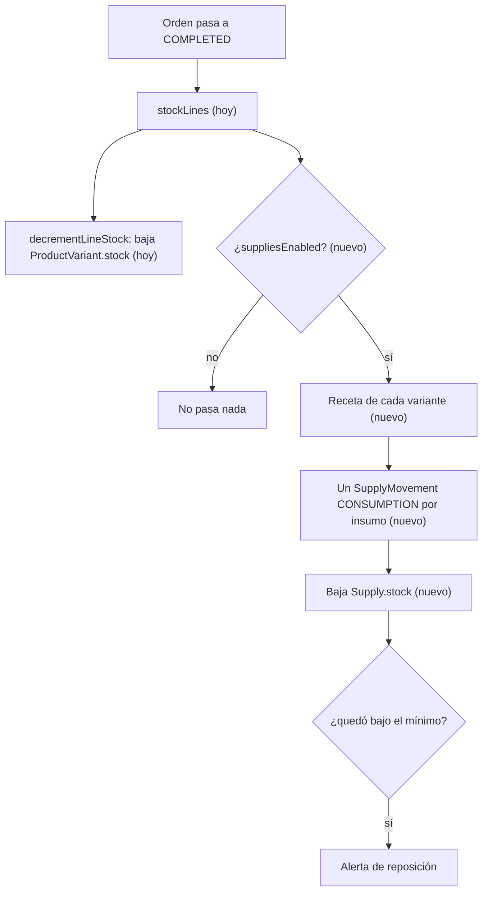

# Insumos (propuesta)

> [!note] Nada de esto existe todavía
> No hay tablas, ni servicio, ni endpoints. Este documento deja el módulo maquetado para
> poder implementarlo sin volver a pensarlo desde cero. Cada afirmación va marcada:
>
> - **[hoy]** — está en el código y se puede señalar con archivo y línea.
> - **[nuevo]** — lo propone este documento y todavía no existe.

Qué es cada cosa en el módulo de insumos, cómo se llama y qué reglas no se pueden violar. Es
normativo: cuando se implemente, el código, la UI y el resto de los documentos usan estos
nombres y ningún otro.

---

## Propósito

Un local que hace un tostado gasta 1 pan tostado, 150 g de queso y 150 g de jamón. El sistema
que usan hoy —FUDO— **le pide a alguien que descargue eso a mano en cada entrega**. Es
trabajo repetido en el peor momento del día, y en la práctica se saltea: a los dos días el
inventario de mercadería dejó de significar algo y nadie vuelve a confiar en él.

La propuesta invierte el orden. Se registra una sola vez la **mercadería core** del local
—pan tostado, queso, jamón, harina— y los productos se **componen** a partir de ella: el
tostado *es* 1 pan + 150 g de queso + 150 g de jamón. Con esa composición cargada, entregar
un tostado descuenta los insumos solo, sin que nadie cargue nada.

El evento que lo dispara ya existe y ya hace exactamente el mismo trabajo para el stock de
producto: el pasaje de la orden a `COMPLETED` **[hoy]** (`services/orders.js:1147-1155`). No
hay que inventar un momento nuevo ni un job: hay que colgarse del que ya está.

**Lo que este módulo NO es.** No es control de proveedores, no es órdenes de compra, no es
producción por lote. Es responder dos preguntas: *¿cuánto me queda de cada cosa?* y *¿cuánto
me sale lo que vendo?*

---

## Entidades

### Insumo **[nuevo]**

**Qué representa.** Una mercadería que el local compra y consume, no que vende: queso, jamón,
pan tostado, harina, servilletas. Es la unidad en la que piensa quien hace las compras.

**Qué lo crea.** Un alta manual desde el panel. No se deriva de nada: el catálogo de insumos
es una decisión del local, igual que el de etiquetas de caja.

**Qué lo destruye.** Un insumo que nunca se movió se puede borrar. Con movimientos, se
**desactiva** — un consumo de hace tres meses tiene que seguir diciendo de qué era. Mismo
criterio que `CashCategory` **[hoy]**.

**Con qué se relaciona.** Con el tenant, que es su dueño. Con sus movimientos. Y con las
recetas que lo usan: un insumo puede estar en muchos productos y un producto lleva muchos
insumos.

**Campos.** `name`, `unit` (la unidad base), `stock`, `minStock` (el mínimo que dispara la
alerta), el costo, `isActive`, `tenantId`.

Ilustrativo, no es código a escribir:

```ts
interface Supply {
  name: string;              // "Queso de máquina"
  unit: "G" | "ML" | "UNIT"; // unidad BASE, ver más abajo
  stock: number;             // en unidad base: 4500 = 4,5 kg
  minStock: number;          // debajo de esto, alerta
  /** Costo promedio ponderado por unidad base. Lo actualiza cada compra. */
  avgCost: number;
  /** Lo que salió la última compra. Va al lado del promedio, no en su lugar. */
  lastCost: number | null;
  isActive: boolean;
}
```

Los dos costos van juntos a propósito. El promedio es con lo que se valoriza el stock y se
costea un producto; el último es el que la persona reconoce cuando abre la pantalla ("el
queso lo pagué $12.000 el kilo"). Mostrar solo el promedio hace que nadie crea el número.

### Unidad **[nuevo]**

**No es una tabla.** Es un enum corto y cerrado: `G`, `ML`, `UNIT`. Gramos, mililitros,
unidades.

Kilos y litros **no existen como unidad guardada**. El stock se guarda siempre en unidad
base y kg/l son formato de pantalla. El motivo es que el local compra en kilos y consume en
gramos, y cualquier modelo que guarde las dos termina arrastrando una matriz de conversiones
que se desincroniza — con el agravante de que el error no se ve: da un número, solo que
multiplicado por mil.

La compra sí declara su **presentación**: "una horma de 3 kg" es un factor de conversión
(3000) que se aplica al cargar el movimiento y no se guarda en el stock. Es la misma decisión
que toma la caja con el signo de los montos: la conversión ocurre en un solo lugar del
código, al escribir, y de ahí para adentro todo es homogéneo.

### Receta **[nuevo]**

**Qué representa.** Qué insumos, y cuánto de cada uno, consume **una unidad vendida** de una
variante. La receta del tostado son tres filas: 1 pan, 150 g de queso, 150 g de jamón.

**No es una tabla con encabezado.** La receta *es* el conjunto de filas de esa variante, igual
que el arqueo son columnas del turno y no una tabla aparte **[hoy]**. Un encabezado se
justificaría el día que la receta necesite datos propios que no se puedan derivar de sus
filas —un rendimiento ("esta masa rinde 20 panes"), un procedimiento, una versión vigente—, y
ese día es el mismo en que entre la producción por lote. Hasta entonces sería una fila que
solo repite que existe.

**Qué la crea.** La edición del producto. Cargar la receta es parte de dar de alta lo que se
vende, no un trámite aparte.

**Qué la destruye.** Vaciarla, o borrar el producto. Borrar una fila **no** revierte consumos
anteriores: los movimientos ya escritos son hechos históricos y no se recalculan.

**Con qué se relaciona.** Una fila apunta a una variante y a un insumo. El par
(variante, insumo) es único: "150 g de queso" no se carga dos veces, se corrige.

```ts
interface RecipeItem {
  variantId: number;
  supplyId: number;
  /** Por UNA unidad vendida, en la unidad base del insumo. 150 = 150 g. */
  quantity: number;
}
```

### Movimiento de insumo **[nuevo]**

**Qué representa.** Una entrada o una salida de mercadería. Es el kardex: la única fuente de
verdad de por qué el stock es el que es.

**Qué lo crea.** Dos orígenes que no se mezclan, exactamente como en la caja **[hoy]**. Los
manuales los carga una persona —compras, mermas, ajustes, conteos—; los de **consumo** los
escribe únicamente el enganche con las órdenes, dentro de la misma transacción que completa
la orden.

**Qué lo destruye.** Nada, nunca. No hay endpoint para editarlo ni para borrarlo. Un error se
corrige con un movimiento nuevo, no tocando el viejo.

**Con qué se relaciona.** Con su insumo, y opcionalmente con la orden y el ítem que lo
originaron.

**Campos.** `type`, `quantity`, `unitCost`, `note`, `supplier`, `orderId`, `orderItemId`,
`createdById`, `createdAt`.

La **cantidad es siempre positiva** y el signo lo aporta el tipo, en un solo lugar del código.
Es la misma decisión que `CashMovement` **[hoy]** (`prisma/schema.prisma:980-982`), y por el
mismo motivo: guardar cantidades con signo invita a que alguien escriba −150 en una compra y
nadie se entere hasta que el inventario no cierre.

| Tipo | Qué es | Signo | Quién lo escribe |
|---|---|---|---|
| `PURCHASE` | Entró mercadería | + | Una persona |
| `CONSUMPTION` | Se gastó al entregar una orden | − | El sistema |
| `WASTE` | Merma: se cayó, se venció, se quemó | − | Una persona |
| `ADJUSTMENT` | Corrección explícita | ± | Una persona |
| `COUNT` | Conteo físico: fija el stock en lo contado | = | Una persona |
| `PRODUCTION` | Reservado para la fase 2 | ± | — |

`COUNT` es el único que no suma ni resta: **fija**. Guarda lo contado y la diferencia contra
lo que el sistema esperaba, igual que el arqueo de caja, y por la misma razón — "conté y
había 4 kg" y "ajusté +200 g" son dos hechos distintos y no se pueden guardar igual.

El movimiento de consumo lleva `orderItemId` con **`@unique`**. Eso es idempotencia
estructural: ni dos requests concurrentes pueden descargar el mismo ítem dos veces. Es
exactamente el mecanismo de `CashMovement.orderPaymentId` **[hoy]**
(`prisma/schema.prisma:995-999`). `orderId` va **sin FK**, por el mismo criterio: el
movimiento es un hecho histórico del inventario y no puede depender de que la orden siga
existiendo.

---

## Vocabulario

Normativo.

| Término | Definición |
|---|---|
| **Insumo** | Mercadería que el local compra y consume. No se vende. |
| **Unidad base** | Gramo, mililitro o unidad. Todo el stock se guarda acá. |
| **Presentación** | Cómo se compra ("horma de 3 kg"). Es un factor, no una unidad guardada. |
| **Receta** | Los insumos que consume una unidad vendida de una variante. |
| **Consumo** | La salida de insumo que genera entregar una orden. La escribe el sistema. |
| **Merma** | Lo que se perdió sin venderse: vencido, caído, quemado. |
| **Ajuste** | Corrección manual explícita del stock. |
| **Conteo** | Contar físicamente y fijar el stock en lo contado. |
| **Mínimo** | El nivel debajo del cual el insumo aparece como "hay que reponer". |
| **Costo promedio** | Costo por unidad base, ponderado por las compras. Con lo que se valoriza. |
| **Costo del producto** | La suma de la receta a costo promedio. |

Dos pares que conviene no confundir:

**Merma contra ajuste.** Tienen la misma forma —el stock baja porque una persona lo dice— y
significan cosas opuestas. La merma es plata perdida y hay que poder sumarla al fin de mes; el
ajuste es que el sistema estaba mal. Meterlos en el mismo tipo hace imposible responder
"cuánto tiré este mes", que es de las pocas preguntas por las que un local carga mermas.

**Insumo contra producto.** Un insumo no se vende y no tiene precio; un producto sí y no se
compra. Cuando algo es las dos cosas —el local vende la gaseosa que también usa en un combo—
son **dos filas**: el producto en el catálogo y el insumo en el inventario, atados por una
receta de una sola línea. Fusionarlos parece ahorrar una fila y termina obligando a que cada
consulta pregunte "¿este de qué lado está?".

---

## Dónde engancha

El punto es único y ya existe. Al completar una orden, el servicio ya resuelve las líneas que
representan consumo real y las descuenta en la misma transacción:

- `services/orders.js:1120` — `stockLines` **[hoy]**: para un combo, sus hijos (los
  componentes elegidos); para una línea normal, ella misma. **Es exactamente la lista que
  necesita el consumo de insumos**, sin tocarla.
- `services/orders.js:1147-1155` — la `$transaction` del `COMPLETED` **[hoy]**. El descuento
  de insumos entra acá, al lado de `decrementLineStock`.
- `services/orders.js:317-343` — `decrementLineStock` **[hoy]** es el modelo a imitar:
  `updateMany` condicional atómico, que es lo que cierra la sobreventa por carrera.
- `services/orders.js:1211` — la invalidación del cache del catálogo **[hoy]**, que solo hace
  falta tocar si algún día el stock del producto pasa a derivarse de los insumos.



Un `COMBO` no tiene receta propia: llega como sus hijos, y cada hijo trae la suya. Eso ya
está resuelto por `stockLines` y no requiere ninguna rama especial.

---

## La trampa del doble stock

Es la decisión que más cuesta si se toma mal, y conviene decirla antes que cualquier otra
cosa del modelo.

Un tostado **no tiene stock propio de verdad**: se arma cuando lo piden. Lo que se agota no es
el tostado, es el jamón. Pero hoy `ProductVariant.stock` es NOT NULL y decide toda la
disponibilidad — el carrito, `showOutOfStock`, `resolveProductStock` **[hoy]**
(`helpers/price.js`). Un producto con receta tendría entonces dos stocks: el suyo, que es
ficción, y el de sus insumos, que es real.

**Recomendación para v1: la receta no cambia cómo se decide la disponibilidad.** Los insumos
arrancan como un **libro paralelo**: descuentan, valorizan y avisan, pero quien manda sobre
"se puede vender" sigue siendo `ProductVariant.stock`. Es completamente aditivo, y es el
criterio que este repo ya demostró con la caja: *con el flag en false NADA cambia*
**[hoy]** (`prisma/schema.prisma:153-160`).

La alternativa —stock derivado, donde lo disponible de un tostado es
`min(floor(stock_insumo / cantidad_receta))`— es la correcta a la larga y por eso queda como
decisión abierta, no descartada. Lo que la hace cara no es la cuenta: es que toca el carrito,
el checkout, el cache del catálogo y el storefront de una sola vez, y que obliga a decidir
qué hace un producto **sin** receta el día que el módulo está prendido. Meterla en la primera
versión convierte un módulo de gestión en una migración del núcleo de ventas.

---

## Opt-in por tenant

`TenantConfig.suppliesEnabled` **[nuevo]**, calcado de `cashRegisterEnabled` **[hoy]**. Con
el flag apagado los endpoints devuelven 404 y el `COMPLETED` no toca nada — no hay
comportamiento nuevo para ningún tenant existente. El servicio abre cada método con un
`assertEnabled()`, como `services/cash-register.js:161` **[hoy]**.

Se prende con un script manual, `prisma/set-supplies.js <slug> on|off`, siguiendo
`prisma/set-cash-register.js` **[hoy]**. **No es parte de un perfil de venta**
(`services/tenant-profiles.js`), por el mismo motivo que la caja: reaplicar un perfil le
apagaría el módulo a quien lo tenga prendido.

A diferencia de la caja, prender esto **no puede trabar una venta** —el consumo avisa, no
bloquea, ver la decisión 1— así que podría llegar a editarlo el tenant. La recomendación
igual es que no: cargar la receta de todo el catálogo es trabajo real, y un flag que se apaga
por curiosidad deja el inventario desfasado sin ninguna señal.

---

## API propuesta

Toda de backoffice. Montada en `/supplies`, con las recetas **adentro del mismo módulo**: si
colgaran de `/variants`, apagar el flag haría 404 en un router que tiene que seguir
funcionando.

| Método | Ruta | Rol | Para qué |
|---|---|---|---|
| GET | `/supplies` | ADMIN, STAFF | Listado con stock, mínimo y costo |
| POST | `/supplies` | ADMIN, STAFF | Alta de insumo |
| PATCH | `/supplies/:id` | ADMIN | Edición |
| DELETE | `/supplies/:id` | ADMIN | Borra si nunca se movió; si no, desactiva |
| GET | `/supplies/summary` | ADMIN, STAFF | Bajo mínimo + valorización del inventario |
| GET | `/supplies/:id/movements` | ADMIN, STAFF | El kardex del insumo |
| POST | `/supplies/:id/movements` | ADMIN, STAFF | Compra, merma, ajuste o conteo |
| GET | `/supplies/recipes/:variantId` | ADMIN, STAFF | La receta de una variante, con su costo |
| PUT | `/supplies/recipes/:variantId` | ADMIN, STAFF | Reemplaza la receta completa |

El `PUT` reemplaza la receta entera en vez de parchear fila por fila. Una receta son tres o
cuatro líneas que se editan juntas en una sola pantalla; el diff lo hace el servidor en una
transacción y el cliente no tiene que orquestar tres requests para mover 150 g de queso a
120.

**Nada del lado `/store`.** El storefront no sabe que existen los insumos y no debería: el
costo de lo que vende un local no es información pública.

---

## Invariantes

Reglas que el sistema no puede violar. Cada una dice si es nueva o si ya tiene precedente.

**Del insumo**

- Un insumo con movimientos no se borra: se desactiva. **Nueva**, con el molde de
  `CashCategory` **[hoy]**.
- El stock siempre está expresado en la unidad base del insumo. **Nueva.**
- La unidad de un insumo **no se cambia** una vez que tiene movimientos: reinterpretaría todo
  su historial. Se da de baja y se crea otro. **Nueva.**

**Del movimiento**

- La cantidad es siempre positiva; el signo lo aporta el tipo. **Nueva**, idéntica a la de
  `CashMovement` **[hoy]** (restricción en la base, no solo en el código).
- Nada se edita ni se borra. Un error se corrige con un movimiento nuevo. **Nueva**, mismo
  criterio que el libro de cobros y los movimientos de caja **[hoy]**.
- Un ítem de orden genera **a lo sumo un** consumo por insumo. **Nueva**, garantizada por
  `@unique` y no por un chequeo previo — igual que `CashMovement.orderPaymentId` **[hoy]**.
- El consumo se escribe **en la misma transacción** que completa la orden: si algo falla, no
  queda ni el cambio de estado ni el descuento. **Nueva**, y sale gratis por dónde engancha.

**De la receta**

- El par (variante, insumo) es único dentro de una receta. **Nueva.**
- Las cantidades son mayores que cero. Una línea de cantidad cero se borra, no se guarda.
  **Nueva.**
- Un `COMBO` no tiene receta propia. **Nueva**, y consistente con que tampoco tiene stock ni
  variantes **[hoy]**.
- Borrar una línea de receta no revierte consumos ya escritos. **Nueva.**

**Transversal**

- Todo `where` lleva `tenantId` explícito: no hay extensión de Prisma que lo inyecte
  **[hoy]** (`docs/ARCHITECTURE.md` §4). Es el riesgo conocido del repo y este módulo no lo
  cambia.

---

## Decisiones abiertas

### 1. Si falta insumo al completar, ¿bloquea o avisa?

**Opciones.** Fallar con 409 y hacer rollback, como `INSUFFICIENT_STOCK` **[hoy]**, o dejar
el insumo en negativo y marcarlo.

**Recomendación: avisa, no bloquea.** Un inventario de insumos casi nunca está al día —nadie
carga la bolsa de harina en el momento en que la abre— y frenar el mostrador por un dato de
gestión rompe la venta real, que es exactamente lo que el módulo no tiene derecho a hacer. El
negativo, además, **es la señal**: significa que falta registrar una compra. Es el mismo
razonamiento por el que la caja acepta un esperado negativo en vez de redondearlo a cero
**[hoy]** (`prisma/schema.prisma:885-889`).

La consecuencia hay que asumirla en voz alta: el stock de insumos es **orientativo**, no
autoritativo. La pantalla tiene que decirlo, y el conteo físico es el que lo devuelve a la
realidad.

### 2. ¿Los insumos llevan costo?

**Opciones.** Solo cantidades, o cantidades más costo.

**Recomendación: con costo, promedio ponderado.** Se actualiza en cada `PURCHASE` y el
movimiento de consumo **congela** el costo del momento — mismo criterio de snapshot que
`OrderItem.price` y el arqueo firmado **[hoy]**. El dato ya está a mano cuando alguien carga
la compra, así que no cuesta trabajo extra, y es lo que habilita la pregunta que el local se
hace de verdad: *¿me conviene el tostado a $3.500?*.

La alternativa —último costo en vez de promedio— es más fácil de explicar y peor: una compra
puntual cara reescribe el costo de todo el stock viejo. Por eso van los dos campos, con
`avgCost` como el que costea.

### 3. ¿Cargar una compra escribe un egreso en Caja?

**Opciones.** No escribir nada, escribir siempre, u ofrecer un check al cargar.

**Recomendación: no en v1, pero dejar el puente documentado.** La etiqueta `insumos` de caja
ya existe **[hoy]** (`prisma/schema.prisma:844`) y el local carga ahí el gasto. Automatizarlo
obliga a **exigir turno de caja abierto para dar de alta una compra**, que es una dependencia
fea entre dos módulos que hoy no se conocen, y obliga a decidir qué pasa con lo que se paga a
30 días — donde la mercadería entra hoy y la plata sale el mes que viene. Son dos hechos con
fechas distintas y forzarlos a un solo acto los miente.

Cuando se enganche, el molde es `recordOrderPayments` **[hoy]**: escribir el movimiento en la
misma transacción, con `@unique` sobre el id de la compra para que sea idempotente.

### 4. ¿Producción por lote?

**Opciones.** Entra en v1, o queda para después.

**Recomendación: fase 2, con el lugar reservado.** Amasar y sacar 40 panes consume harina y
**sube** stock de producto terminado: es el modelo opuesto al consumo al vender, y arrastra
rendimiento, mermas de proceso y productos semielaborados —el pan es insumo del tostado *y*
producto que se vende solo—. Es la mitad del trabajo de una panadería y no entra de prepo en
una primera versión.

Lo que sí se hace ahora es dejarle lugar: el valor `PRODUCTION` en el enum de movimientos, y
la nota de que ese es el día en que la receta gana encabezado (para poder declarar el
rendimiento del lote).

### 5. ¿Proveedor como entidad?

**Recomendación: texto libre en v1**, mismo criterio que `CashMovement.payee` **[hoy]**
(`prisma/schema.prisma:987-989`). El proveedor al que se le compra el queso no es un `User`
del sistema y no tiene nada colgando. Una tabla se justifica cuando aparezca algo que colgar:
cuenta corriente, listas de precios, frecuencia de reposición.

### 6. ¿Categorías de insumo?

**Recomendación: no en v1.** Una lista de 30 insumos se recorre con los ojos; una taxonomía
sobre 30 filas es trabajo de carga que no responde ninguna pregunta. Si aparece la necesidad,
el molde ya está dos veces en el repo: `CashCategory` y `TenantAttribute` **[hoy]**.

### 7. ¿El stock del producto pasa a derivarse de la receta?

**Recomendación: diferida**, por lo desarrollado en *La trampa del doble stock*. El camino,
cuando se tome, es un `stockMode` por variante (`OWN` | `SUPPLIES`) en vez de un flag global:
un local tiene las dos cosas a la vez —la gaseosa se stockea, el tostado se arma— y un
interruptor único lo obliga a elegir mal para la mitad de su catálogo.

---

## Fases

1. **Inventario.** Insumos, unidades, movimientos manuales (compra, merma, ajuste, conteo),
   mínimos y alerta de reposición. Sirve solo, sin recetas: ya reemplaza la planilla.
2. **Recetas.** Composición por variante y costo del producto. Todavía sin descontar nada:
   permite cargar y revisar el catálogo antes de que empiece a mover stock.
3. **Consumo automático.** El enganche con el `COMPLETED`. Es el punto del módulo, y va
   último a propósito: prenderlo con las recetas a medio cargar produce un inventario que
   miente más que el que no existía.
4. **Producción por lote.** Fase 2 de verdad — ver la decisión 4.

---

## Relacionado

**Mismo hemisferio (backend)**

- [[Productos]] — el catálogo. La receta cuelga de la variante por lo que dice esa nota.
- [[Variantes]] — la unidad real de venta: precio, stock y, con esto, receta.
- [[Combos]] — un combo no tiene receta; la tienen sus componentes.
- [[Órdenes]] — el `COMPLETED` es el único evento que escribe consumo.
- [[Caja]] — la etiqueta `insumos` y el puente de la decisión 3.
- [[Estadísticas]] — el costo de lo vendido es lo que le falta al dashboard para hablar de
  margen y no solo de facturación.
- [[TenantConfig]] — dónde vive el flag de opt-in.
